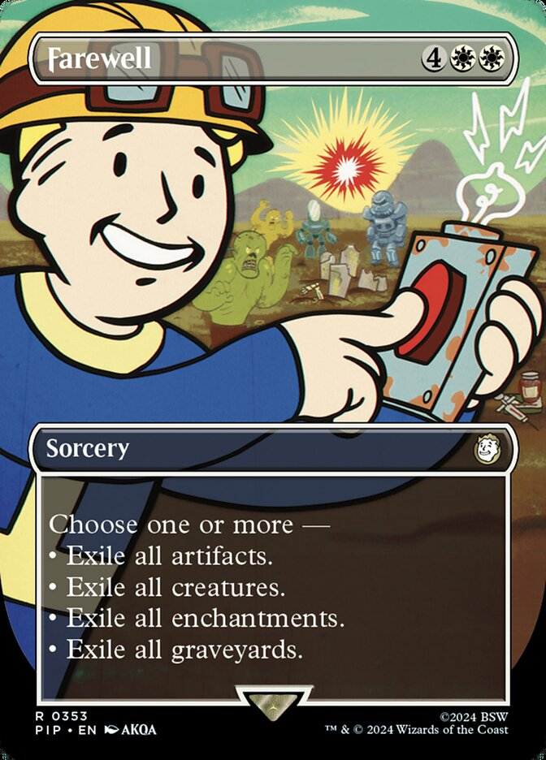
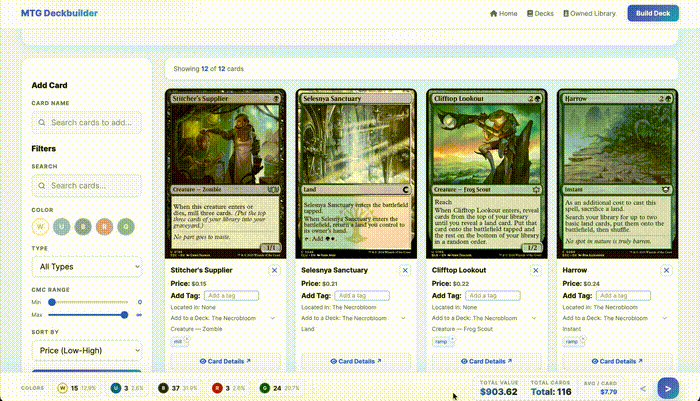
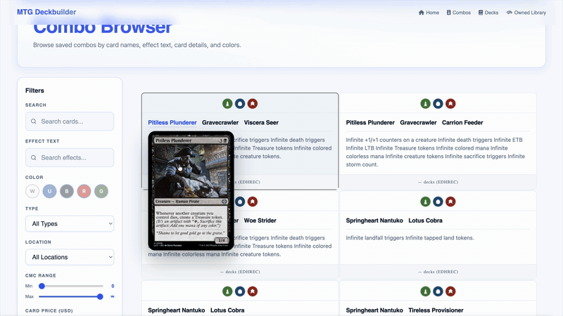

<a id="top"></a>

<div align="center">
  <div style="display: flex; align-items: center; justify-content: center; gap: 30px; background-color: #1e1e24; padding: 25px; border-radius: 12px; margin-bottom: 20px;">
    
    
  </div>

## Modern MTG Deck Builder & Collection Manager

Built with **Spring Boot** • **React** • **TypeScript** • **PostgreSQL** • **Docker**
</div>

---


---

## Navigation

* [Overview](#overview)
* [Features](#features)
* [Deck Builder](#card-deck-builder)
* [Combo Browser](#combo-browser)
* [Installation](#installation)
* [Verification](#verification)
* [Contributing](#contributing)
* [Credits](#credits)
* [Star History](#star-history)

---

<a id="overview"></a>


---

Farewell is an open-source **Magic: The Gathering deckbuilding application** designed to help players build, manage, and analyze their decks and collections.

Inspired by platforms such as **Moxfield** and **Archidekt**, Farewell aims to provide a modern, feature-rich deckbuilding experience while integrating community-driven resources like **Commander Spellbook**.

What began as a passion project to solve my own deckbuilding challenges has evolved into a platform focused on:

* Building and managing decks
* Tracking personal collections
* Discovering card combos and synergies
* Analyzing deck statistics
* Streamlining the brewing process

Whether you're building your next Commander deck, refining a competitive list, or exploring hidden interactions, Farewell provides the tools and information you need in one place.

<div align="center">
  
</div>

<div align="right">
  <a href="#top"><kbd>⬆ Back to Top</kbd></a>
</div>

---

<a id="features"></a>


---

### Deck Building

* Create and manage Commander decks
* Organize cards using custom categories
* Real-time deck validation and statistics
* Fast card search powered by Scryfall

### Collection Management

* Manage your personal MTG collection
* Track card ownership and quantities
* Monitor collection value
* Search and filter cards instantly

### Combo Discovery

* Integration with Commander Spellbook
* Automatically discover combos in decks
* Explore synergistic card interactions
* Find combo pieces already present in your collection

### Analytics

* Mana curve visualization
* Color distribution analysis
* Card type breakdowns
* Collection valuation insights
* Deck composition statistics

### Technology Stack

* Spring Boot
* React
* TypeScript
* PostgreSQL
* Docker
* Scryfall API
* Commander Spellbook API

<div align="right">
  <a href="#top"><kbd>⬆ Back to Top</kbd></a>
</div>

---


---

<a id="card-deck-builder"></a>


---

Build and refine Commander decks with drag-and-drop card organization, live validation, and instant search.

<div align="center">
  
</div>

<div align="right">
  <a href="#top"><kbd>⬆ Back to Top</kbd></a>
</div>

---

<a id="combo-browser"></a>


---

Browse and filter combo lines from Commander Spellbook, explore card interactions, and find synergies for your decks.

<div align="center">
  
</div>

<div align="right">
  <a href="#top"><kbd>⬆ Back to Top</kbd></a>
</div>

---

<a id="installation"></a>


---

### Clone the Repository

```bash
git clone https://github.com/ToroDDT/Java-MTG-Deckbuilder.git

cd Java-MTG-Deckbuilder
```

### Configure PostgreSQL

Create a PostgreSQL database:

```sql
CREATE DATABASE mtg_deckbuilder;
```

Update your application configuration:

```properties
spring.datasource.url=jdbc:postgresql://localhost:5432/mtg_deckbuilder
spring.datasource.username=your_username
spring.datasource.password=your_password
```

### Run the Backend

```bash
./mvnw spring-boot:run
```

### Run the Frontend

```bash
cd frontend

npm install

npm run dev
```

### Run with Docker

```bash
docker-compose up --build
```

<div align="right">
  <a href="#top"><kbd>⬆ Back to Top</kbd></a>
</div>

---

<a id="verification"></a>


---

Run the test suite:

```bash
./mvnw test
```

For frontend tests:

```bash
npm test
```

<div align="right">
  <a href="#top"><kbd>⬆ Back to Top</kbd></a>
</div>

---

<a id="contributing"></a>


---

Contributions are welcome!

If you would like to improve Farewell:

1. Fork the repository
2. Create a feature branch
3. Commit your changes
4. Open a Pull Request

Please open an issue first if you plan on making significant changes.

<div align="right">
  <a href="#top"><kbd>⬆ Back to Top</kbd></a>
</div>

---

<a id="star-history"></a>


---

[](https://starchart.cc/ToroDDT/Java-MTG-Deckbuilder)

<div align="right">
  <a href="#top"><kbd>⬆ Back to Top</kbd></a>
</div>

---

<a id="credits"></a>


---

Special thanks to:

* The Commander Spellbook team
* The Scryfall team
* Contributors and testers
* The Magic: The Gathering community

For detailed acknowledgements, see:

```text
CREDITS.md
```

---

<div align="center">

Made with ❤️ for the Magic: The Gathering community.

<sub>Last Updated: June 2026</sub>

</div>

---

This project follows the all-contributors specification. Contributions of any kind are welcome.
